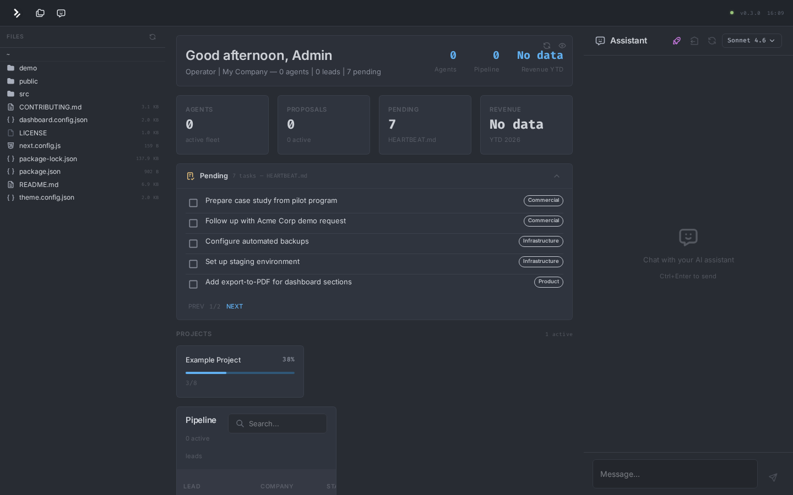

# Ontology Dashboard

An ontology-driven operations dashboard with multi-LLM chat, Zed-inspired layout, and zero database.




## What is this?

A single-page operations dashboard that reads your workspace files (Markdown, JSONL, JSON) and renders them as live sections — tasks, projects, pipeline, git log, financials. It includes a multi-LLM chat panel with tool use, so the AI can read files, search, and operate on your workspace.

**Everything is config-driven.** One JSON file defines your sections, parsers, tools, and layout. No code changes needed to customize.

### Key Features

- **Zed-inspired 3-column layout** — File tree | Overview | Chat, all resizable with drag handles
- **7 LLM providers, 21+ models** — Anthropic, OpenAI, Google, Moonshot, xAI, Inception, OpenRouter. One adapter pattern, ~50-100 LOC each
- **Tool use loop** — AI can read files, list directories, search content (up to 10 tool iterations per message)
- **Ontology-driven config** — `dashboard.config.json` defines everything: sections, parsers, tools, layout
- **Zed One Dark theme** — Customizable via `theme.config.json`
- **File browser with inline editor** — Browse, preview, and edit files directly
- **Git integration** — Commit changes with auto-classified JSONL write-back
- **Zero database** — Pure filesystem. Markdown in, dashboard out
- **Optional auth** — JWT-based login, or run without auth for local use

## Quick Start

```bash
git clone https://github.com/fstech-digital/ontology-dashboard.git
cd ontology-dashboard
npm install
cp .env.example .env
# Add your Anthropic API key to .env
npm run dev
```

Open http://localhost:3333. That's it.

The dashboard ships with demo data in `demo/` so you can see it working immediately.

## Configuration

### `dashboard.config.json`

```json
{
  "instance": {
    "name": "My Company",
    "title": "Ontology Dashboard"
  },
  "sections": [
    { "id": "welcome", "enabled": true },
    { "id": "heartbeat", "enabled": true },
    { "id": "projects", "enabled": true },
    { "id": "pipeline", "enabled": true },
    { "id": "gitlog", "enabled": true }
  ],
  "parsers": {
    "heartbeat": { "file": "HEARTBEAT.md" },
    "projects": { "dir": "projects" }
  },
  "tools": ["read_file", "list_directory", "ontology_search"]
}
```

### Environment Variables

| Variable | Required | Description |
|----------|----------|-------------|
| `DASHBOARD_ANTHROPIC_KEY` | Yes | Anthropic API key |
| `DASHBOARD_OPENAI_KEY` | No | OpenAI API key |
| `DASHBOARD_GOOGLE_KEY` | No | Google Gemini API key |
| `DASHBOARD_MOONSHOT_KEY` | No | Moonshot (Kimi) API key |
| `DASHBOARD_XAI_KEY` | No | xAI (Grok) API key |
| `DASHBOARD_INCEPTION_KEY` | No | Inception (Mercury) API key |
| `DASHBOARD_OPENROUTER_KEY` | No | OpenRouter API key |
| `DASHBOARD_USER` / `DASHBOARD_PASS` | No | Enable login auth |
| `ONTOLOGY_PATH` | No | Override workspace root |

## Architecture

```
┌─────────────────────────────────────────────────────┐
│                    Top Bar (48px)                    │
├──────────┬──────────────────────┬───────────────────┤
│          │                      │                   │
│  File    │     Overview         │    Chat Panel     │
│  Tree    │     (sections)       │    (SSE stream)   │
│  300px   │     flex: 1          │    380px          │
│          │                      │                   │
│  drag ↔  │  ┌──────────────┐    │  ┌─────────────┐  │
│          │  │ WelcomeCard  │    │  │ Model       │  │
│          │  │ Heartbeat    │    │  │ Selector    │  │
│          │  │ Projects     │    │  │             │  │
│          │  │ Pipeline     │    │  │ Messages    │  │
│          │  │ GitLog       │    │  │ + Tools     │  │
│          │  │ ...          │    │  │             │  │
│          │  └──────────────┘    │  └─────────────┘  │
└──────────┴──────────────────────┴───────────────────┘
```

### Multi-LLM Adapter Pattern

Each provider is a thin adapter (~50-100 LOC) that normalizes to SSE:

```
chat.js (router, ~65 LOC)
  └─► getAdapter(providerId)
        ├─► anthropic.js   (native SDK stream)
        ├─► openai.js      (OpenAI SDK, also used by Moonshot/xAI/Inception)
        ├─► google.js      (@google/generative-ai SDK)
        ├─► moonshot.js    (OpenAI SDK + baseURL)
        ├─► xai.js         (OpenAI SDK + baseURL)
        ├─► inception.js   (OpenAI SDK + baseURL)
        └─► openrouter.js  (OpenAI SDK + baseURL)
```

All adapters emit the same SSE events: `token`, `tool_use_start`, `tool_result`, `usage`, `done`, `error`.

### Section Registry

Sections are registered in `src/lib/section-registry.js`. To add a section:

1. Create the component in `src/components/sections/`
2. Register it with a unique ID
3. Add the ID to `dashboard.config.json`

### Parsers

Parsers in `src/lib/parsers.js` read workspace files and extract structured data:

- `parseHeartbeat` — Counts `[ ]` and `[x]` checkboxes from Markdown
- `parseSpecProgress` — Tracks project completion from `_specs.md` files
- `parseComercial` — Aggregates JSONL logs into pipeline view
- `parseCrons` — Extracts automation tables from Markdown
- `parsePinAgents` — Reads agent hierarchy from Markdown tables
- `aggregateFinanceiro` — Sums JSONL financial records by month

## Stack

| Layer | Tech |
|-------|------|
| Framework | Next.js 13.5 (Pages Router) |
| UI | MUI 5, Emotion |
| Charts | ApexCharts |
| Icons | Iconify (Tabler) |
| Chat | Server-Sent Events (SSE) |
| Auth | JWT (jsonwebtoken) |
| LLMs | Anthropic SDK, OpenAI SDK, Google GenAI SDK |

## Data Format

The dashboard expects your workspace to contain standard files:

- **`HEARTBEAT.md`** — Task list with `- [ ]` checkboxes
- **`projects/<name>/_specs.md`** — Project specs with checkbox progress
- **`pins/<name>.md`** — Operational pins with agent/cron tables
- **`logs/comercial/*.jsonl`** — Commercial activity logs

See the `demo/` directory for examples.

## Contributing

See [CONTRIBUTING.md](CONTRIBUTING.md) for architecture overview and development guide.

## License

MIT — see [LICENSE](LICENSE).

---

Built by [FSTech Digital](https://fstech.digital). Powered by the Operational Ontology framework.
